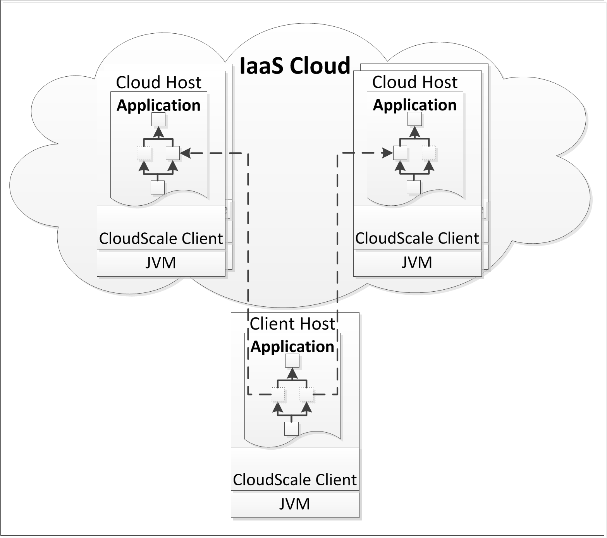
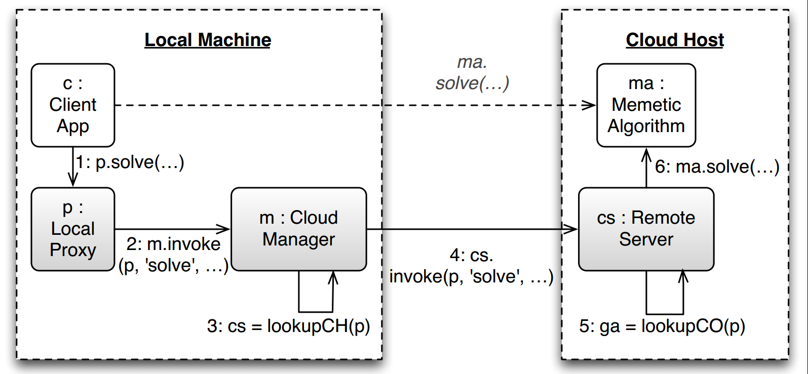

#  Introduction 

JCloudScale is a framework for deploying and managing applications in an **Infrastructure-as-a-Service** cloud, for instance [Amazon EC2](http://aws.amazon.com/ec2/). Essentially, JCloudScale wants to allow you to write a distributed, elastic application like a regular (local) Java app. The general concept of JCloudScale is to use aspect-oriented programming  (AOP) techniques to dynamically modify the bytecode of Java-based applications, and transparently move designated (via annotations) parts of the application (which we refer to as *cloud objects*) to virtual resources in the cloud (referred to as *cloud hosts*). This process is transparent to the application developer, and is completely automated. In the end, applications built on top of JCloudScale look like regular (local) Java applications, but are actually executed in a distributed fashion.

The basic architecture of many JCloudScale applications is depicted below.

## What Kind of Applications Can Profit from JCloudScale?

JCloudScale is perfectly suited to help you build applications that are:

* **multi-threaded** - they inherently want to do multiple things in parallel.
* **computation-heavy** - some of the things the application wants to do take a long time to finish and produce significant processor load.
* **memory-heavy** - application operations require significant amount of memory that are hard to satisfy on a single machine.
* **elastic** - load on the application is not always the same, and the application should adapt its usage of cloud resources based on current load.

How does JCloudScale help you with such applications? It lets you focus on what matters - your business logics. All the pesky interactions with the cloud are handled by JCloudScale. In many applications, you do not even see the cloud anymore in your application.

##  Required Software 

As the JCloudScale project and necessary infrastructure is based on Java, any operation system may be used. We have tested JCloudScale on many versions of Windows, Mac OS X, and Linux.

Before you start, please ensure that the following software is available or installed on your machine (recommended version is specified in italic, however newer versions should work as well, unless specified otherwise).

1. Java JDK (*Oracle Java SE JDK 1.7*)
1. Apache Maven (*Maven 3.0*) - JCloudScale is developed as Maven  project and is available as maven artifact. The easiest approach for you would be to base your own application on Maven as well. Of course, this is not mandatory, but otherwise dependency management and aspect weaving become more cumbersome to configure correctly. Read [here](UsingJCSWithoutMaven.md) how to use JCloudScale without Maven.
1. **Optional**: Apache ActiveMQ (*Apache ActiveMQ 5.8.0*) - JCloudScale uses ActiveMQ service for communication between clients and cloud hosts. For production deployment, a stand-alone ActiveMQ instance should be used. If you are just toying around or testing your solution, you do not need an ActiveMQ installation, as JCloudScale is able to instantiate an integrated message queue if no external MQ is available.

##  Javadocs 

Please find the automatically generated API documentation for JCloudScale [here](http://xleitix.github.io/jcloudscale/apidocs/).

##  Current Version 

This documentation describes the latest stable JCloudScale release **0.4.0**. As we are continuing working on this project, latest version can be found in our [maven repository](http://www.infosys.tuwien.ac.at/mvn/jcloudscale/). Note, however, that newer versions do not necessarily have the same API and behavior may differ from the one described here.

#  Basic Usage 

*This section focuses on Maven-based projects. If you want to use JCloudScale without Maven, read [this article](UsingJCSWithoutMaven.md) first.*

As a first step to get started with JCloudScale, you need to add it to your project's list of dependencies in your Maven `pom.xml` file.

       <dependency>
			<groupId>jcloudscale</groupId>
			<artifactId>jcloudscale.core</artifactId>
			<version>0.4.0</version>
       </dependency>

In addition, as JCloudScale is not yet registered in public maven repositories, you need to add a reference to the [TU Wien Infosys](http://www.infosys.tuwien.ac.at/) maven repository as well:

    <repositories>
    	<repository>
    		<id>infosys-repository</id>
    		<url>http://www.infosys.tuwien.ac.at/mvn</url>
    	</repository>
    </repositories>

However, this is not the only required change to the build process. Additionally, as JCloudScale uses [AspectJ](http://www.eclipse.org/aspectj/) to weave its code into your application, you will need to add compile-time weaving as another step of your compilation process. Many things can be tweaked here, but for most cases it should be sufficient to simply add this plugin configuration to your `pom.xml` file (into `plugins` subsection of a `build` section):

    <plugin>
    	<groupId>org.codehaus.mojo</groupId>
    	<artifactId>aspectj-maven-plugin</artifactId>
    	<version>1.4</version>
    	<configuration>
    		<source>1.7</source>
    		<target>1.7</target>
    		<complianceLevel>1.7</complianceLevel>
    		<verbose>true</verbose>
    	</configuration>
    	<executions>
    		<execution>
    			<configuration>
    				<XnoInline>true</XnoInline>
    				<aspectLibraries>
    					<aspectLibrary>
    						<groupId>jcloudscale</groupId>
    						<artifactId>jcloudscale.core</artifactId>
    					</aspectLibrary>
    				</aspectLibraries>
    			</configuration>
    			<goals>
    				<goal>compile</goal>
    				<goal>test-compile</goal>
    			</goals>
    		</execution>
    	</executions>
    	<dependencies>
    		<dependency>
    			<groupId>org.aspectj</groupId>
    			<artifactId>aspectjrt</artifactId>
    			<version>1.7.0</version>
    		</dependency>
    		<dependency>
    			<groupId>org.aspectj</groupId>
    			<artifactId>aspectjtools</artifactId>
    			<version>1.7.0</version>
    		</dependency>
    	</dependencies>
    </plugin>

Now it is time to actually start using JCloudScale in the application. The key concept of the JCloudScale is the notion of **cloud objects**. Cloud objects are represented by Java classes annotated with the `@CloudObject` annotation. Whenever JCloudScale finds the creation of the new instance of the class using this annotation, it replaces the constructor call with the code necessary to select a remote host for the object and deploy it there, providing only a proxy object to the application. Following, any invocations on this proxy object actually become remote method invocations on the cloud object. 

A simple cloud object is defined as below.

    
    @CloudObject
    public class MyCloudObject
    {
      
     public String doThings() { ... }
    
     public void doOtherThings(String param1, String param2) { ... }   
    
     @DestructCloudObject
     public void iAmDone() { ... }
    
    }

Every instance of `MyCloudObject` is instantiated on a remote host, and all invocations to this object are redirected to this host. As soon as the method `MyCloudObject.iAmDone()` is invoked, the cloud object is destroyed on the remote host (and any subsequent invocations to this object will trigger `JCloudScaleException`s).

Using this cloud object in your code is simple. It is just like using any other Java object:

    System.out.println("Starting");
    MyCloudObject object = new MyCloudObject();
    System.out.println(object.doThings());
    object.doOtherThings("first", "second");
    object.iAmDone();
    System.out.println("Done");

Note that this simple code snippet actually already triggers some serious back-and-forth between your client application and the remote host, as indicated by the control flow figure below.

When using JCloudScale, you should also indicate when your application does not require JCloudScale anymore and can be shut down. To do this, you can use the `@JCloudScaleShutdown` annotation. After the execution of the method annotated with it, JCloudScale will insert necessary calls to gracefully destroy all remaining cloud objects and shutdown any additional infrastructure created by the framework to communicate with the remote hosts. 

    @JCloudScaleShutdown
    public static void main(String[] args) { ... }
	
Alternatively, you can invoke `JCloudScaleClient.closeClient()` in order to shutdown all JCloudScale infrastructure manually. Don't forget, that any interaction with JCloudScale after shutdown will cause exceptions.

##  Interacting With Cloud Objects 

As is the case for any object in Java, clients can fundamentally interact with cloud objects in two different ways: (1) invoking methods of cloud objects, and (2) getting and setting member fields directly. Additionally, cloud objects (more concretely, the classes defining cloud objects) may contain static fields and static methods. It is important for users to understand what technically happens in JCloudScale in each of those cases.

* **Client invokes a (non-static) method** - JCloudScale will intercept this method call and schedule its execution on one of the remote hosts. The client will block until the cloud host returns the result of this invocation (or signals completion in case of void methods).

        CloudObject co = new CloudObject();
        co.invokeMe();
    
* **Client sets a (non-static) field** – JCloudScale will intercept this set operation and instruct the cloud host that is responsible for this object to set the value in his copy instead. The proxy in the client VM maintains the old value. The client will block until the value is successfully changed on the server.

        co.publicField = "hugo";

* **Client gets a (non-static) field** – JCloudScale will intercept this get operation and request the current value from the cloud host that is responsible for this object. This value is returned to the client. The proxy in the client VM does not change.

        System.out.println(co.publicField);

* **Client invokes a static method** – JCloudScale will not intercept this operation. The static method will execute in the client VM.

        CloudObject.invokeMeStatically();

* **Client gets or sets a static field** – JCloudScale will not intercept this operation. The static field in the client VM will be used 

        CloudObject.staticPublicField = "hugo_static";
        System.out.println(CloudObject.staticPublicField);

Additionally, there is also another case that needs to be discussed in this place. Sometimes, cloud objects (i.e., code running on a cloud host, not the client) might want to get or set the value of static fields. Consider the following case:

    @CloudObject
    public class MyCO {
    
     public static String someValue;
    
     public void doSomething() {
    		someValue = "newValue";
     }
    
    }

This is somewhat problematic, as the semantics outlined so far will likely not be what the author of this code intended. To be concrete, in this case, the static field `someValue` is what we call **JVM-local** – i.e., every remote host (and the client JVM, if this is relevant) have a separate value for `someValue`, and the value is not synchronized between different hosts. Put differently, the value of this field is depending on which host a cloud object is physically deployed on. This is generally a *bad thing* in JCloudScale. Hence, it is possible to explicitly demark (non-final) shared static fields in cloud objects using the `CloudGlobal` annotation.

    
    @CloudObject
    public class MyCO {
    
     @CloudGlobal
     public static String someValue;
    
     public void doSomething() {
    		someValue = "newValue";
     }
    
    }

The semantics of interacting with cloud-global fields are as follows:

* **Cloud object sets a cloud-global field** – JCloudScale will intercept this set operation and instruct the client via callback that it should set this value instead. The cloud object will block until the value is successfully changed on client-side.

* **Cloud object gets a cloud-global field** – JCloudScale will intercept this get operation and request the current value from the client. This value is returned.

Likely, this will capture the intend of the author of the above code snippet better. However, users should keep in mind that getting and setting cloud-global fields involves remoting and is hence significantly more expensive than regular static field access. Furthermore, note that getting and setting cloud-global fields is by default just as unsynchronized as interaction with regular static fields. If one cloud object sets a static field, there is no guarantee that another cloud object will not swoop in and override this value immediately. 

**Warning**: using the reflection API for interacting with cloud objects is problematic, as it will partially circumvent the mechanisms we use for intercepting method invocations, and get and set operations. Unfortunately, many libraries and third-party middleware use reflection internally, for instance to create objects on the fly. Hence, we have gone through some pain to make the basic uses cases of JCloudScale play nicely with reflection, however, in some cases (especially in combination with the by-reference semantics) users may encounter bugs and unexpected behavior when using reflection.

##  Passing Parameters By-Value and By-Reference 

Whenever data is passed between regular Java objects running in the JVM of the client application and cloud objects (for instance, as parameters or return values of method invocations of cloud objects, or as values of fields of cloud objects), two different semantics can be used: **by-value** or **by-reference**. The following simple rules apply. 

Data is passed **by-value** *iff* it is:
* a Java primitive type (`int`, `short`, etc.) 
* wrapper of a primitive type (`Integer`, `Short`, etc.) 
* of type `String` 
* [Enum Type](http://docs.oracle.com/javase/tutorial/java/javaOO/enum.html)
* either class, invocation or invocation parameter is annotated with `@ByValueParameter`

In all other cases, data is passed by-reference. Some examples follow: 

    
    @CloudObject
    public class MyCO {
    
     @ByValueParameter
     public MyComplexObject field1; // by-value
    
     public String field2; // by-value
    
     public MyComplexObject field3; // by-reference
    
     public @ByValueParameter MyComplexObject getSomething() {
        ... // return value by-value
     }
    
     public void doSomething(MyComplexObject  parameter) {
    	... // parameter by-reference
     }
    
     @ByValueParameter
     static class MyParameter implements Serializable {
       // class is annotated with @ByValueParameter, 
       // all invocations where this type will be involved will be processed by-value.
     }
    
     private MyParameter updateMyParameter(MyParameter param) {
      ... //return value and parameter are passed by-value 
          // as the class MyParameter is annotated with @ByValueParameter
     }
    
     // However, even if MyParameter will be passed here, parameter will be passed by-reference!
     public void updateMyParameter(Object obj) { 
    
     }
     
Note that by-value data passing requires the object to be serializable (i.e., to implement the `Serializable` interface). For by-reference data, this is not required as such data is never actually sent over the wire. However, types used for by-reference data passing need to provide a default no-arg constructor. 

Parameters that are passed by-reference continue to exist only within the client JVM. Hence, invoking methods of by-reference parameters always leads to a callback to the client application. Users should keep this in mind when interacting with by-reference parameters (i.e., in general, invocations to by-reference parameters should be minimized).

**Warning**: at the moment, we are not providing any convenience functions for deciding on by-reference or by-value in addition to the simple rules stated above. For instance, if you declare a field as by-value, it will not automatically be considered by-value in other contexts (for instance, when using this field as return value of a getter). Declare by-value explicitly whenever you want data to be serialized or annotate declared parameter type itself if you want it to be passed by-value in all cases.

##  Restrictions on Cloud Objects and By-Reference Classes 

Whenever user constructs the new instance of Cloud Object or passes parameter to the Cloud Object invocation by reference, JCloudScale constructs a proxy object that is used to intercept all invocations to this object with the help of [CGLib](http://cglib.sourceforge.net/). This approach simplifies the code and extends possibilities, but has some limitations. Here's the list of the things that users should be aware of.

Both, Cloud Objects and objects passed by-reference:
* Must **have** empty (no-args) constructor. (*this limitation might be loosened in future*)
* Must **not** use methods `finalize()` and `clone()` as they are not handled correctly. (*this limitation might be loosened in future*)
* Must **not** use any finalized methods (e.g., `getClass()`, `notify()`, `wait()`, etc. or user-defined methods with modifier `final`) as they won't be intercepted at all.
* Should **avoid whenever it is possible** to use these objects in hash maps or sorting lists as each invocation to methods `compareTo()`, `equals()` and `hashCode()` with require remote call and will slow down execution a lot. Consider to base sorting and hashing on some by-value passed parameter or value that identifies this object. (e.g., string, int).

#  JCloudScale Configuration 

##  Creating Configuration 

JCloudScale can be configured either directly from code (likely the easier version), or via an XML configuration file. Below, you see a simple code snippet that showcases how to create and modify the configuration.

    JCloudScaleConfiguration config = new JCloudScaleConfigurationBuilder().build();
    config.common().clientLogging().setDefaultLoggingLevel(Level.OFF);

This configuration can also be stored to a file:

    config.save(new File("config.xml"));

As well as loaded from a file:

    config = JCloudScaleConfiguration.load(new File("config.xml"));

##  Specifying Configuration 

After you obtained an instance of `JCloudScaleConfiguration`, you have to inform JCloudScale framework to use this configuration. You can do that multiple ways, each of them has own benefits and restrictions.

1. **You can specify configuration manually.** To do this, you have to provide an instance of the `JCloudScaleConfiguration` class to the static method `setConfiguration` of the `JCloudScaleClient` class. However, you have to do that **prior to any interaction** with the JCloudScale framework, because otherwise some components might be initialized with the default configuration before you provide correct one.

        JCloudScaleConfiguration config;
        ...
        JCloudScaleClient.setConfiguration(config);

1. **You can specify where to get the configuration from.** To do this, you have to set system property `jcloudscale.configuration` (specified by the public constant `JCloudScaleClient.JCLOUDSCALE_CONFIGURATION_PROPERTY`) to point either to the file where configuration is stored or to the class that has the static parameterless method annotated with `@JCloudScaleConfigurationProvider` annotation and returns an instance of `JCloudScaleConfiguration`: 

        @JCloudScaleConfigurationProvider
        public static JCloudScaleConfiguration createConfiguration() {
         ... // obtain configuration instance and configure it
         return config;
        }

You can set system property from the code (assuming that file "config.xml" exists in the current directory):

    System.setProperty("jcloudscale.configuration", "config.xml");

However, this approach does not give you any benefits in comparison to the first one: anyways you have to do that before any interaction with the JCloudScale framework. The real benefit of this approach is that this property can be specified before running the application. To do this with maven, you can apply the following changes the `pom.xml` (to the `exec-maven-plugin` in the `<plugins>` configuration section):

    <configuration>
    	<executable>java</executable>
    	<arguments>
                   ...
    		<argument>-Djcloudscale.configuration=config.xml</argument>
    		...
    	</arguments>
    </configuration>

You can do that without maven as well. In this case you have to provide mentioned above line as command-line argument to the java process that starts your application:

    java -Djcloudscale.configuration=config.xml app.main.Class

**This approach is recommended**, as it minimizes amount of possible issues and problems with configuration specification. However, in order to ensure that your configuration is indeed used by JCloudScale, verify that your changes to configuration influence JCloudScale behavior. For example, you can set logging to `INFO` or `ALL` and see that the amount of logging messages significantly increased. Also you should see the following message:
    
    INFO: JCloudScale successfully loaded configuration from <your configuration source here>

Additionally, you may verify if your configuration is indeed used by all JCloudScale components. If you see the following message (ensure `WARNING` logging is enabled in configuration you provide), than you are either setting configuration multiple times (e.g., from system property *and* from the code) or providing configuration too late and some components are already using default one:

    WARNING: JCloudScale configuration redefinition: Replacing configuration instance. Some components might be still using the previous version of the configuration. 

##  Configuration Structure 

To understand better what can be configured within the JCloudScale framework, here is the complete list of the configuration modules with short explanations. Some modules will be explained in more detail below.

1. *Common Configuration*: contains parameters that are shared by client and server.
    1. *Class Loader Configuration*: contains type and configuration specific to the appropriate class loader. Default implementation is the `CachingClassLoaderConfiguration`.
    1. *Client Id*: The unique identifier of the client that allows server to distinguish between clients and communicate with them. For example, when application restarts, cloud host can detect that this is already a different application run.
    1. *Client Logging Configuration*: The configuration of the Logging of the JCloudScale components that work on the client.
    1. *Communication Configuration*: The configuration of the Message Queue connection and data transferring parameters.
    1. *Monitoring Configuration*: The configuration of the JCloudScale state monitoring and events processing.
    1. *Scaling Policy*: A user-provided Java class that specifies the rules how the Cloud Host is selected for the new instance of the Cloud Object. By default, `HostPerObjectScalingPolicy` is used.
    1. *UI Configuration*: The configuration of the management interface, which allows monitoring what is actually happening within the application. 
1. *Server Configuration*: contains parameters that are specific for the server.
    1. *Cloud Platform Configuration*: The configuration specific for the selected platform. By default it is represented by `LocalCloudPlatformConfiguration` to allow application testing on local machine. In order to make use of the real cloud, it should be replaced by an instance of `EC2CloudPlatformConfiguration` or `OpenstackCloudPlatformConfiguration`.
    1. *Server Logging Configuration*: The configuration of the Logging for the JCloudScale components that work on the server.
1. *Version*: the version of the JCloudScale platform that created this configuration object.

##  Writing Scaling Policies 

JCloudScale framework itself cannot detect how Cloud Objects should be mapped to the Cloud Hosts and how many hosts should be used. Hence, you should select or write a scaling policy that fits your needs. You can use predefined scaling policies from the package `at.ac.tuwien.infosys.jcloudscale.policy.sample`, but to get really the best performance and resource usage, you might need to write your own scaling policy that will decide which host to select based on the number of already running machines, size of the task, planned amount of machines, current load of each machine or some other rules that might be important for your application.

To create your own scaling policy, you have to create a class that extends `at.ac.tuwien.infosys.jcloudscale.policy.AbstractScalingPolicy` class and provide an instance of this class to JCloudScale configuration (see [how to configure JCloudScale](Documentation.md#jcloudscale-configuration)).

    
    public abstract class AbstractScalingPolicy
    { 
    	/**
    	 * Selects the virtual host for the new cloud object.
    	 * @param newCloudObject The descriptor of the new cloud object.
    	 * @param hostPool The host pool that contains the set of available hosts and allows 
    	 * to perform additional scaling operations on these hosts.
    	 * @return The host that should be used to deploy new cloud object.
    	 */
    	public abstract IHost selectHost(ClientCloudObject newCloudObject, IHostPool hostPool);
    	
    	/**
    	 * This method is called periodically 
    	 * (with the period specified by <b>scaleDownInterval</b> from common configuration) 
    	 * to perform scaling down and cloud usage optimization tasks. 
    	 * @param hostPool The host pool that contains the set of available hosts and allows 
    	 * to perform additional scaling operations on these hosts. 
    	 * @param scaledHost Indicates the host that reached the next <b>scaleDownInterval</b>.
    	 * @return <b>true</b> if the specified host should be scaled down. Otherwise, 
    	 * if the specified host has to stay online for another scaling interval, <b>false</b>. 
    	 */
    	public abstract boolean scaleDown(IHost scaledHost, IHostPool hostPool);
    }

As you can see, you have to implement two methods that will allow JCloudScale to scale up and down. The first method, `selectHost` will be called on each Cloud Object creation and has to answer the question *"Which host should this object be deployed to"*? It receives as parameters a descriptor of the new Cloud Object (containing unique ID of the cloud object, it's class, and proxy object that will be used to perform all invocations after object will be deployed to the cloud host) and reference to the cloud hosts' pool that allows to perform various manipulations with the set of available hosts (like, get available hosts, start new host or shutdown existing host). JCloudScale expects this method to return the reference to the cloud host that `newCloudObject` should be deployed on.

Second method from this interface has slightly different semantics. As cloud providers usually have billing based on time periods (billing period, usually a hour) starting from the host startup time, JCloudScale allows user to scale down similarly. Whenever the new host is started, `scaleDown` method will be called periodically to determine if the host specified by `scaledHost` parameter should be scaled down now or not. If the user answers `true`, all objects running on this host will be destroyed and the host will be terminated (therefore, you should either never terminate hosts with objects running on them or never use objects deployed to this host after host termination). Scaling down method invocation interval can be configured within common section of configuration (see [how to configure JCloudScale](Documentation.md#jcloudscale-configuration)).

The decision in both methods should be based on the type of the object, expected operations on this object and current state of running cloud hosts. For each cloud host you have following information available:
* **Host ID**, that allows identifying host uniquely. *This property is available only when host is online.*
* **Host IP Address**, that gives you the IP address of the host. *This property is available only when host is online.*
* **Startup Time**, that specifies when the host was started up (if the host is running already). 
* **Last Request Time**, that specifies when was the last interaction with this host.
* **Online**, that allows you to determine if host is running. If this value is `false`, the host may be either still starting up or already shutting down. You can detect this by checking **Startup Time** value: if host did not start yet, this value will be empty.
* **Cloud Objects**, that allows you to count or iterate cloud objects that are currently deployed on this host.
* **Current CPU Load**/**Current RAM Usage**, that allow you to determine the last measurement of CPU and RAM usage on this host. To be able to use this values, you have to enable monitoring (see [configuration section](Documentation.md#jcloudscale-configuration)). In addition, you should be aware that these values are not actual and show the last reported usage, what may different from the current values. The interval to measure these and other metrics can be configured within monitoring configuration as well.

## Local vs. Cloud Deployment

Testing cloud applications can be tricky, as debugging physically disparate applications is not an easy task. Hence, JCloudScale provides two separate modes of deployment. Firstly, the **local deployment** mode is your default for building and testing applications. In local deployment, separate JVM instances are used instead of actual remote hosts. That is, whenever an application would normally want to request a new host from the cloud, it starts a new JVM on `localhost` and deploys the cloud object there. No actual distribution over multiple hosts happens. 

If the application is working as expected in local deployment mode, you can switch to **cloud deployment** mode, which will actually physically distribute the application. Currently JCloudScale supports Openstack and Amazon EC2 as cloud deployment platform. In this mode, all platform-specific operations (e.g., machine startup/shutdown) will be performed over the [JClouds API](http://jclouds.apache.org), while all other communication with cloud hosts and cloud objects will happen over the message queue.

### Configuring Message Queue Server

While in local deployment mode JCloudScale manages Message Queue Server seamlessly for the application, in cloud deployment mode it is recommended to configure [ActiveMQ Server](http://activemq.apache.org) manually or use preconfigured image for selected cloud platform. When the Message Queue server is up and running, configure JCloudScale to access it (e.g., by using `withMQServer` method of `JCloudScaleConfigurationBuilder` configuration class). Additionally, **ensure that Message Queue server is accessible, by the configured hostname and port, to other cloud hosts** that will be started by JCloudScale in order to scale your application, as otherwise your application will fail with timeout exception waiting for cloud hosts to start and connect to message queue.

### JCloudScale-based Application Architecture

In general, any JCloudScale-based solution consists of *cloud workers* (cloud hosts that host and execute cloud objects), *messaging server* (that handles and routes all communication between components) and *initial application* (that coordinates the whole solution and starts any interaction). Generally, it is recommended (but not strictly required) to deploy all parts of your application within the cloud, as this decreases amount of communication that needs to be performed beyond the boundaries of the cloud and dramatically speeds up your application. 

Each cloud worker is always deployed on the separate cloud host and should be the only resource-intensive process on that particular host. To remove any influence and simplify solution architecture, messaging server and initial application should also be deployed on the separate hosts. However, if initial application does not require a lot of resources, messaging server and initial application can be co-located on the same host. This may increase performance (as a significant part of messaging will be performed within the localhost) and decrease overall maintenance and costs (as there's one server less to maintain).

### Using Openstack Cloud Platform

Before you can start using Openstack from JCloudScale-based application, you have to create a virtual machine image that has an instance of JCloudScale Server **of the same version** running.

To get such an image, either refer to our [tutorial on building server images](BuildingServerImages.md), or download our [pre-built image (0.4.0)](http://www.infosys.tuwien.ac.at/staff/leitner/cloud_images/JCloudScale_v0.4.0.img).

If you don't want to specify the name or id of the created image in the application configuration explicitly, you have to name it accordingly to JCloudScale conventions. If neither name nor id of the virtual machine image is specified, JCloudScale tries to find the image that is named `"JCloudScale"+"_v"+JCloudScaleConfiguration.CS_VERSION` (e.g., `JCloudScale_v0.4.0` if application is using JCloudScale with version 0.4.0).  Additionally, an Apache ActiveMQ instance needs to be available that is accessible both from the client and from cloud hosts. We do not provide a specific ActiveMQ image, as ActiveMQ can be easily installed on any Linux-based operating system, e.g., via apt-get in Debian-based distributions.

In addition, to speedup application startup process, you can use **static JCloudScale instances**. Static instance is the virtual machine that has JCloudScale service running and is started prior to application startup. At startup, JCloudScale queries for running cloud hosts through message queue. Hosts that answered are used as static hosts. Therefore, to become a static instance, JCloudScale service should be properly configured to connect to the correct message queue server. 

Static instances will not be shut down on application termination unless application shuts down them explicitly. To start a new static host, you can use **JCloudScale Static Host Management Tool** that allows you to start and stop available static hosts. Note, that this tool requires a file with serialized configuration (see [configuration section](Documentation.md#jcloudscale-configuration)) that will be used by your main application to configure static hosts accordingly. (*The tool is under development and will be available soon*)

**Note** that you do not need access to a real IaaS cloud for local deployment. However, access credentials to an IaaS cloud are required as soon as you switch to cloud deployment.

Further note that local deployment is **not** meant for production. Realistically, we cannot think of a good reason to ever write an application with JCloudScale if you do not intend to deploy it to an actual cloud. Local deployment is a tool to ease the development and testing process, and nothing more.

Selecting the deployment mode is part of JCloudScale [configuration](Documentation.md#jcloudscale-configuration). Just selecting local deployment without further customization can be done as below.

    new JCloudScaleConfigurationBuilder()
      .build();
	  
Local deployment can be additionally configured like this:

    new JCloudScaleConfigurationBuilder(new LocalCloudPlatformConfiguration()
			.withStartupDirectory("target/")
			.withClasspath("lib/*")
			.withJavaHeapSizeInMB(6000))
    	.build();

Openstack mode is selected similarly, but requires some configuration properties to be able to operate with running instances in the cloud. The simplest configuration looks like this:

    new JCloudScaleConfigurationBuilder(
    		new OpenstackCloudPlatformConfiguration
    			(identityPublicURL, tenantName, imageName, login, password))
     .build();

To avoid these cumbersome and huge list of parameters, you can use another overload that accepts instance of `Properties` object with all Openstack-specific parameters:

    Properties openstackProperties = new Properties();
    ... //fill in properties here
    new JCloudScaleConfigurationBuilder(
      new OpenstackCloudPlatformConfiguration(openstackProperties))
      .build();

The properties that are expected are:
* `OS_AUTH_URL` that specifies Authentication URL.
* `OS_TENANT_NAME` that specifies Openstack tennant name.
* `OS_USERNAME` that specifies Openstack user login.
* `OS_PASSWORD` that specifies Openstack user password.

In addition, for testing or prototyping purposes mostly, as it hardly makes sense to store access credentials in plain text, JCloudScale allows to specify the path to the file where these properties can be loaded from:

    String openstackPropertiesFilename = "...";
    new JCloudScaleConfigurationBuilder(
      new OpenstackCloudPlatformConfiguration(openstackPropertiesFilename))
      .build();

Additionally, you can conveniently specify other configuration properties of JCloudScale or cloud platform:

    new JCloudScaleConfigurationBuilder(
    	new OpenstackCloudPlatformConfiguration
    		(identityPublicURL, tenantName, imageName, login, password)
    		.withSshKey(sshKeyName)
    		.withInstanceImage(imageName))
      .with(scalingPolicyInstance)
      .withLogging(loggingLevel)
     .withMqServer(hostname, port)
     .withMonitoring(true)
     .build();

All other parts of the application are not dependent on the selected platform and everything should work the same way independently of selected cloud platform. However, after switching for cloud deployment mode, the application will be actually distributed over multiple machines with, possibly, different operation system and file system, what might cause difference in execution and behavior.

###  Deployment in EC2 

To the largest extend, deployment in EC2 works exactly like explained above for Openstack. The main difference is that instead of using `OpenstackCloudPlatformConfiguration`, an instance of `EC2CloudPlatformConfiguration` should be passed to the JCloudScale configuration. This configuration mostly has the same property values as explained for Openstack. The core difference is that it requires the availability of an AWS properties file with the following content:

    accessKey = YOUR_ACCESS_KEY_IN_AWS
    secretKey = YOUR_SECRET_KEY_IN_AWS

Furthermore, an AMI that implements the JCloudScale server component is required. For version 0.4.0, you can use the public image `ami-4f645e26` or `ami-80ce38f7` in EC2. Alternatively, you can easily build your own image based on our [tutorial](BuildingServerImages.md).

    new JCloudScaleConfigurationBuilder(
    	new EC2CloudPlatformConfiguration()
    		.withAwsConfigFile(awsFilePath)
    		.withAwsEndpoint(awsEndpoint)  
    		.withInstanceImage(imageName)
    		.withInstanceType(instanceTypeName)
    		.withSshKey(sshKeyName))
      .build();
	  
Additionally, don't forget to setup and configure AciveMQ server as it was described [above](Documentation.md#configuring-message-queue-server).

#  Event-Based Monitoring 

Writing useful scaling policies is often the hardest part of building your JCloudScale application. For simple policies, users can use the information provided directly through the API, as discussed in [Scaling Policies](Documentation.md#writing-scaling-policies) documentation section. However, oftentimes, users may want to scale based on data that is more application-specific than CPU or RAM utilization (for instance based on the number of violations of Service Level Agreements on each host). Such use cases are covered by JCloudScale's event-based monitoring interface.

JCloudScale integrates a powerful [Esper](http://esper.codehaus.org/)-based complex event processing (CEP) engine. Via Esper, useful metrics can be defined as CEP statements on streams of monitoring data produced by JCloudScale and the cloud objects.

##  Available Default Events 

If monitoring is enabled via the configuration, JCloudScale automatically triggers a set of predefined events that can be used in CEP statements. Monitoring is enabled via

    new JCloudScaleConfigurationBuilder()
     .withMonitoring(true)
     .build();

The following predefined events then become available:

* State Events:
 * `at.ac.tuwien.infosys.jcloudscale.messaging.objects.monitoring.CPUEvent` - triggered periodically, and contains the current CPU load at a given host.
 * `at.ac.tuwien.infosys.jcloudscale.messaging.objects.monitoring.RAMEvent` - triggered periodically, and contains the current utilization of the Java heap space of the host JVM.

* Cloud Object Events:
 * `at.ac.tuwien.infosys.jcloudscale.messaging.objects.monitoring.ObjectCreatedEvent` - triggered whenever a new instance of a cloud object is deployed.
 * `at.ac.tuwien.infosys.jcloudscale.messaging.objects.monitoring.ObjectDestroyedEvent` - triggered whenever an instance of a cloud object is destroyed.
 * `at.ac.tuwien.infosys.jcloudscale.messaging.objects.monitoring.ExecutionStartedEvent` - triggered whenever a method of a cloud object starts to execute.
 * `at.ac.tuwien.infosys.jcloudscale.messaging.objects.monitoring.ExecutionFinishedEvent` - triggered whenever a method of a cloud object completes successfully.
 * `at.ac.tuwien.infosys.jcloudscale.messaging.objects.monitoring.ExecutionFailedEvent` - triggered whenever an execution of a cloud object throws an exception.

**Note:** on server-side, the generation of State Events (`CPUEvent`, `RAMEvent`) can be obtained in multiple ways. By default, JCloudScale tries using the best available approach. The most precise and complete implementation is the one based on a Java-based monitoring library called [Sigar](http://www.hyperic.com/products/sigar), which uses the Java Native Interface (JNI) to call operating system functions. If you are using the **local** development mode of JCloudScale and you want to receive State Events generated by Sigar implementation, you need to configure `LocalCloudPlatformConfiguration` with the path to a correct native `libsigar` [binaries](https://support.hyperic.com/display/SIGAR/Home#Home-binaries) for your platform. To do this, you have to specify `java.library.path` system variable: `localCloudPlatformConfiguration.addCustomJVMArgs("-Djava.library.path=<folder_with_sigar_native_libraries>")`. If you are building a server image yourself, don't forget to include this system variable into the script you use to start JCloudScale server process.

##  Triggering Custom Events 

In addition to the predefined events listed above, users may want to define and trigger their own evens from their cloud objects. To do so, users should first define their event classes as regular Java beans, which subclass `at.ac.tuwien.infosys.jcloudscale.messaging.objects.monitoring.Event`. An example is given below:

    
    public class DurationEvent extends Event {
    	
    	private static final long serialVersionUID = 1L;
    	
    	private long duration;
    	private String hostId;
    	
    	public DurationEvent() {} 
    	
    	public DurationEvent(long duration, String hostId) {
    		this.duration = duration;
    		this.hostId = hostId;
    	}
    	
    	public long getDuration() {
    		return duration;
    	}
    	public void setDuration(long duration) {
    		this.duration = duration;
    	}
    	public String getHostId() {
    		return hostId;
    	}
    	public void setHostId(String hostId) {
    		this.hostId = hostId;
    	}
    } 

Before this new event can be triggered and used in CEP statements, it needs to be registered to the event engine. This is also done as part of the configuration:

    new JCloudScaleConfigurationBuilder()
     .withMonitoring(true)
     .withMonitoringEvents(DurationEvent.class)
     .build();

Triggering such events in cloud objects is rather easy. Cloud objects can let JCloudScale inject event sinks, which new events are then written to:

    
    @CloudObject
    public class MyCloudObject {
    
     @EventSink
     private IEventSink events;
    
     public void myMethod() {
       events.trigger(
         new DurationEvent(DURATION, HOST_ID)
       );
     }
    
    }

##  Scaling Based on Events 

Both, predefined and custom, events can be used in monitoring metrics within scaling policies. Before usage, monitoring metrics need to be registered with JCloudScale:

    MonitoringMetric metric = new MonitoringMetric();
    metric.setName("AvgProcessingTimeMetric");
    metric.setEpl(
      "select avg(duration) as avg_dur from ClassificationDurationEvent.win:time(10 sec)"
    );
    EventCorrelationEngine.getInstance().registerMetric(metric);

Once the metric is registered, current (as well as historical) values of the metric can be retrieved easily:

    HashMap mapValue = (HashMap) EventCorrelationEngine.getInstance()
      .getMetricsDatabase().getLastValue("AvgProcessingTimeMetric");
    double avgDuration = (Double) mapValue.get("avg_dur");

If a metric should not be monitored any longer, it should be unregistered:

    EventCorrelationEngine.getInstance().unregisterMetric("AvgProcessingTimeMetric");

The `epl` field in `MonitoringMetric` can contain any valid Esper CEP statement. At this point, we do not provide a complete documentation of what users can do with Esper, but check the very exhaustive [online documentation](http://esper.codehaus.org/esper-4.9.0/doc/reference/en-US/html/processingmodel.html) on the Esper web page.

#  JCloudScale API 

Typically, JCloudScale applications follow a declarative approach, where objects that should be scaled are annotated with the `@CloudObject` annotation. In most use cases, this approach works fine. However, occasionally, users might want to follow a more traditional and imperative approach.  

JCloudScale supports the imperative programming style via the `at.ac.tuwien.infosys.jcloudscale.api.CloudObjects` API. For most users, the most relevant method provided by this API is `CloudObjects.create(...)`, which allows to use an instance of arbitrary type as cloud object. 

    MyRegularObject myObject =  CloudObjects.create(MyRegularObject.class, "constructorParam");

Note that `MyRegularObject` is not annotated with `@CloudObject`, but will behave like an instance of an annotated type from now on. However, evidently, destruction of such objects also needs to be triggered explicitly.

    CloudObjects.destroy(myObject);

##  Advantages and Disadvantages 

This syntax has a a number of advantages and disadvantages as compared to the declarative, annotations-based programming model.

Advantages:

* **Flexible** - unlike the declarative model, which follows more of an *all-or-nothing* mentality, the imperative programming model allows users to specify on instance level which instances should be deployed to the cloud and which should remain regular local Java objects. **Note** that this can also be implemented (somewhat cumbersomely) in the declarative model using local constructors (i.e., constructors with the `@Local` annotation).

* **Supports third-party types** - one disadvantage of the declarative model is that it requires source-code access to the type used as cloud object (to add the required annotations). The imperative model allows to deploy instances of types which user cannot modify.

Disadvantages:

* **Intrusive** - the biggest disadvantage of this model is that it couples users much more strongly to JCloudScale than the declarative model. Typically, any JCloudScale application can be run without JCloudScale simply by disabling AspectJ weaving during build. With the imperative model, this is not quite as straight-forward anymore.

* **Separation-of-concerns** - one of the claims of JCloudScale is that it enables a clean separation of concerns, with JCloudScale handling cloud deployment and the application handling the actual business logics. With the imperative model, this separation of concerns is somewhat more diluted, as the application now explicitly contains code to create and destroy cloud objects.

As a general rule of thumb, we suggest using the declarative model unless users have a specific use case that requires using the imperative programming model.

#  File Dependencies 

If the Cloud Object's code or any code that is invoked from the Cloud Object needs some external files to run (e.g., configuration files, initial data or state), after the code distribution this files obviously will be missing and code will fail with `FileNotFoundException`. 

To inform JCloudScale that this class has some additional file dependencies, `@FileDependency` annotation can be used. Whenever JCloudScale detects first usage of class annotated with this annotation, it transfers additional dependencies specified with this annotation to the cloud host (this happens during class loading, therefore all files should be ready at the moment of creation and deployment of the Cloud Object).

Files that should be deployed to the cloud host can be specified in 2 different ways. 

1. In case the set of files is fixed and known prior to application compilation, they can be enumerated inside the annotation:

        @FileDependency(files = {"1.txt", "resources/2.txt", "files/3.txt"})
        public class ClassWithDependencies 
        {
          ...
        }

2. If the set of files that should be loaded is not known on the application compilation time or developer would prefer to populate this list dynamically, dependency provider approach can be used. To use this approach, `@FileDependency` annotation's property `dependencyProvider` should be initialized with the class that implements `IFileDependencyProvider` and provides the set of files necessary to the annotated class:
				
        @FileDependency(dependencyProvider= MyDependencyProvider.class)
        public class ClassWithDependencies 
        {
          ...
        }
        
        public class MyDependencyProvider implements IFileDependencyProvider 
        {
        	@Override
        	public DependentFile[] getDependentFiles() 
        	{
        		List<DependentFile> dependentFiles = new ArrayList<DependentFile>();
        		File fileFolder = new File("files");
        		if(fileFolder.exists())
        		{
        			for(File file : fileFolder.listFiles())
        			{
        				if(file.isFile())
        					dependentFiles.add(new DependentFile(file.getPath()));
        			}
        		}
        		
        		return dependentFiles.toArray(new DependentFile[dependentFiles.size()]);
        	}
        }
    
Note that it is preferable to keep all dependent files within application directory and specify them with the relative path from the current working directory. However, if the specified file is outside of the working directory, JCloudScale will still try to deploy it on the cloud host.

##  Dynamic File Dependency Handling  

In case you have a dynamic set of files that you need to transport to cloud hosts, and this set of files is not known during classloading (or may change during application runtime), the approach described above will not work. 

In this case, the [getResourceAsStream](http://docs.oracle.com/javase/6/docs/api/java/lang/ClassLoader.html#getResourceAsStream(java.lang.String)) method of classloaders can be used to obtain files dynamically from the client on demand. 

**Note** that in order to be loaded successfully, the files you are trying to load have to be on the application classpath of the client. Otherwise **null** will be returned.

To use this feature, you need a JCloudScale-aware classloader. The best way to obtain such classloader in the code of a cloud object or in any dependent code is to use classloader that loaded the cloud object:

    ClassLoader myClassLoader = this.getClass().getClassLoader();

After that, application can request the input stream of the needed file and work with it normally.

    String fileClasspath = "1.txt";
    InputStream fileAsStream = myClassLoader.getResourceAsStream(fileClasspath);

**Note** that as long as file you are trying to load is on classpath, you can use any classloader in client-side code (the code that is not executing on remote host). However, described above approach universal and should work for any code, thus we recommended to use it always to load resources from classpath. 

#  JCloudScale Command Line Interface 

The current version of JCloudScale includes a primitive command line management interface, which lets users see which hosts and cloud objects currently exist in a JCloudScale application.

##  Building the CLI 

The commandline interface can be built and executed from the source code distribution available from Google Code (`mvn clean compile exec:exec` from the `ext/CmdClient` subdirectory). Depending on whether you have built JCloudScale before, you may need to install the jcloudscale-core package into your local maven repository first (`mvn clean install -DskipTests` from the `core` subdirectory).

##  Using the MVN Binary Version of the CLI 

Alternatively, users can also just get and start a binary distribution of the CLI, which is accessible via MVN dependencies. To do so, users should add the following dependency to their MVN build:

    <dependency>
    	<groupId>jcloudscale</groupId>
    	<artifactId>jcloudscale.cli</artifactId>
    	<version>0.2.0</version>
    </dependency>

With this dependency in place, the CLI can be started by running `at.ac.tuwien.infosys.jcloudscale.cli.CLI`. For instance, users could add the following profile to their MVN build:

    	<profiles>
    		<profile>
    			<id>cmd-client</id>
    			<activation>
    				<activeByDefault>false</activeByDefault>
    			</activation>
    			<build>
    				<plugins>
    					<plugin>
    						<groupId>org.codehaus.mojo</groupId>
    						<artifactId>exec-maven-plugin</artifactId>
    						<executions>
    							<execution>
    								<goals>
    									<goal>exec</goal>
    								</goals>
    							</execution>
    						</executions>
    						<configuration>
    							<executable>java</executable>
    							<arguments>
    								<argument>-Djava.util.logging.config.file=target/classes/logging.properties</argument>
    								<argument>-classpath</argument>
    								<classpath />
    								<argument>at.ac.tuwien.infosys.jcloudscale.cli.CLI</argument>
    							</arguments>
    						</configuration>
    					</plugin>
    				</plugins>
    			</build>
    		</profile>
    	</profiles>

Now, the CLI can be started easily from this project via `mvn exec:exec -Pcmd-client`.

##  CLI Usage 

The CLI is a prompt which currently supports the following commands:

* `con` (*or* `connect`) `MQ_ADDRESS` - connect to a message queue used by a JCloudScale installation. This is typically the first thing you want to do.

        jcloudscale> connect 128.131.172.119

* `discon` (*or* `disconnect`) - disconnect from the message queue. You should do that before closing the prompt.

        jcloudscale> disconnect

* `exit` - close the prompt.

        jcloudscale> exit

* `?list` - list all available commands.

        jcloudscale> ?list

* `ls-ch` (*or* `list-ch`) - List all hosts currently used by this JCloudScale installation.

        jcloudscale> ls-ch

* `ch` (*or* `ch-details`) `UUID_OF_HOST` - Show details to the host with the given UUID.

        jcloudscale> ch f3d1dbfa-74d1-43af-ab05-ce45cb432dd9

* `ls-co` (*or* `list-co`) - List all (not destroyed) cloud objects.

        jcloudscale> ls-co

* `add-ch` - Create a new host. The new host will be used for new cloud objects.

        jcloudscale> add-ch

* `del-ch` (*or* `destroy-ch`) `UUID_OF_HOST` - Destroy the host with the given UUID. **Warning** - check first if there are any cloud objects deployed to this host, as they will be destroyed along with the host, leaving your application potentially in an inconsistent state.

        jcloudscale> del-ch f3d1dbfa-74d1-43af-ab05-ce45cb432dd9

* `del-co` (*or* `destroy-co`) `UUID_OF_CLOUDOBJECT` - Destroy cloud object with the given UUID. **Warning** - make sure that your application handles the unexpected destruction of cloud objects gracefully.

        jcloudscale> del-co d55dbcb1-8d23-4e63-b6b4-5741fce7e189

#  Data Store Integration 

The current version of JCloudScale also includes a custom library for mapping Java objects to NoSQL data stores (among other features). Brief initial documentation of these features can be found in a separate [page](DatastoreAPI.md). As the data store library is an extension component, you will need to add another dependency to your build:

    <dependency>
      <groupId>jcloudscale</groupId>
      <artifactId>jcloudscale.datastorelib</artifactId>
      <version>0.4.0</version>
    </dependency>

#  Building Hybrid Cloud Applications 

Documentation TODO, please check back later.

#  Migrating Cloud Objects 

Documentation TODO, please check back later.

#  Full List of Annotations 

In this table, you can find all annotations used by JCloudScale and a brief explanation for reference. All annotations are in the `at.ac.tuwien.infosys.jcloudscale.annotations` package.

|**Annotation** | **Legal On** | **Summary** |
| ------------- | ------------ | ----------- |
| `@ByValueParameter`| Serializable method parameters, return values, fields and types| Indicates parameters and fields that should be transferred using by-value semantics.
| `@CloudGlobal`| Static fields| Indicates that the value of a static field should be kept consistent among all cloud hosts.
| `@CloudObject`| Types| Denotes cloud objects.
| `@CloudObjectId`| Fields of type `String` or `UUID` in cloud objects| Dependency injection annotation, fields annotated with this will get injected with the unique identifier of this cloud object.
| `@CloudObjectParent`| Types| Subclasses of this object are cloud objects (but this object is not).
| `@JCloudScaleConfigurationProvider`| Static parameterless methods| This method can be used to provide a configuration object for JCloudScale.
| `@JCloudScaleShutdown`| Methods| JCloudScale is terminated after this method has finished successfully.
| `@DestructCloudObject`| Methods of cloud objects| This cloud object instance is destroyed after this method has finished successfully.
| `@EventSink`| Fields of cloud objects| Dependency injection annotation, fields annotated with this will get injected with an event sink that cloud objects can use to write custom events to.
| `@FileDependency`| Types| Tells the remote classloader that this class depends on specific files, which need to be loaded along with the class.
| `@Local`| Constructors of cloud objects| Used to demarcate constructors of cloud objects which should not be intercepted (used to instantiate local instances of cloud objects).
